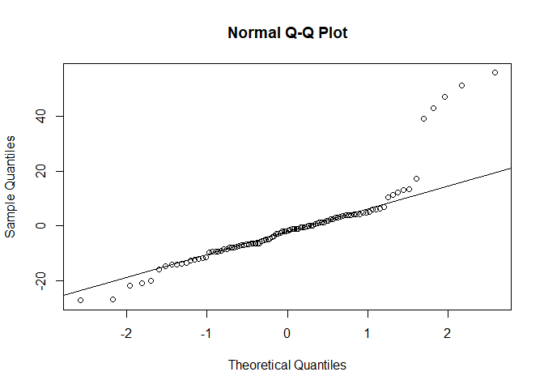
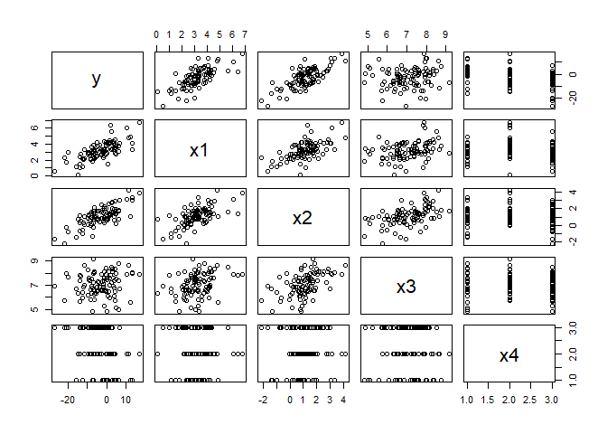
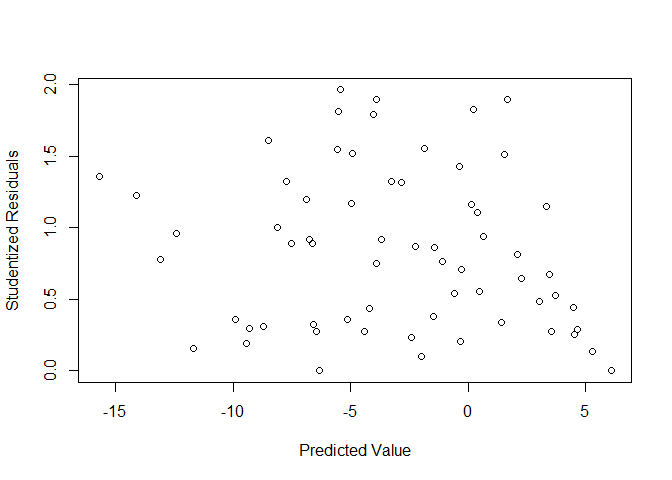
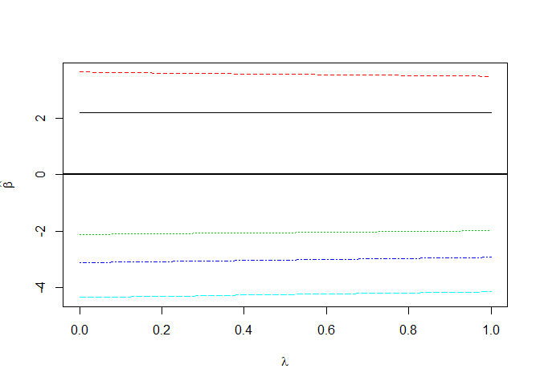

Regresyon Varsayımları ve Çözümlemesi
================
Mert Yanık

Elimizde 3 sürekli bağımsız, 1 kategorik bağımsız ve 1 tane bağımlı
değişkenin olduğu veriler vardır. Amacımız bu 4 bağımsız değişkeni
kullanarak en iyi ve anlamlı doğrusal regresyon modelini oluşturmak ve
bağımlı değişkeni tahmin etmektir.

Not: Veriler yapay olarak bilgisayar ortamında üretilmiştir.

Öncelikle veri kümesini içeri aktaralım. X4 değişkeni kategorik değişken
olduğu için bu değişkeni as.factor() fonksiyonu ile içeri aktarıyoruz.

``` r
library(readr)
data <- read_table2("C:/Users/user/Desktop/Regresyon/data.txt")
names(data)<-c("y","x1","x2","x3","x4") 
attach(data)

data['x4'] = as.factor(x4)
attach(data)
```

# Varsayımlar

Anlamlılığı sağlatmak adına model oluşumuna geçmeden önce regresyon için
gerekli olan bazı varsayımları sağlatmamız gerekmektedir.

## Normallik Varsayımı

Bu varsayımlardan ilki **normallik** varsayımıdır. Normallik varsayımı
elimizdeki bağımlı değişkenin(y) hatalarının normal dağılması gerektiği
anlamına gelmektedir. Hatalar ile bağımlı değişkenin kendisi aynı
istatistiksel dağılıma sahip olduğu için bu kontrolü bağımlı değişken
değerlerinin kendisi üzerinden gerçekleştirebiliriz.

**Kaynağı**:

1)  Aykırı değerlerin, etkili gözlemlerin olması.

2)  Bağımlı değişken değerlerinin kesikli olması.

3)  Değişen varyanslılık gibi başka varsayım bozulumlarının olması.

**Etkisi**: Hipotez testleri ve güven aralıkları normallik varsayımı
gerektirdiğinden normalliğin sağlanmaması hipotez testlerinin ve güven
aralıklarının sonuçlarını etkiler. Bu durumda yaptığınız testler doğru
sonuç vermez.

**Sorunun Giderilmesi**:

1)  Aykırı değerler ya çıkartılır ya da düzeltilir.

2)  Değişen varyanslılık gibi varsayım bozulumları giderilir.

3)  Dönüşüm yapılabilir.

Öncelikle grafik incelemesi üzerinden normalliğe bakalım.

``` r
qqnorm(y)
qqline(y)
```

<!-- -->

Grafikte görüldüğü üzere 45 derecelik yatay çizgiden çok fazla veri
sapmaları olmuş. Bu bir ön inceleme olarak normallik varsayımının
sağlanmadığının göstergesidir.

Şimdi buna test ederek bakalım.

``` r
library(nortest)
ad.test(y)
```

    ## 
    ##  Anderson-Darling normality test
    ## 
    ## data:  y
    ## A = 4.9286, p-value = 2.797e-12

Ho; Bağımlı değişken normal dağılıma uymaktadır.

Hs; Bağımlı değişken normal dağılıma uymamaktadır.

P-Value değeri, alfa=0,05’ten küçük olduğu için bağımlı değişken normal
dağılıma uymamaktadır. Bu sorunu çözmek için grafik üzerinde görülebilen
bazı aykırı değerleri silebiliriz.

``` r
boxplot(y)
```

<!-- -->

Grafikte görüldüğü üzere -20’den küçük ve 40’tan büyük 7 tane aykırı
değer vardır. Bunlardan 6 tanesini silelim.

``` r
data = data[-c(49,34,70,31,98,92),]
attach(data)
ad.test(y)
```

    ## 
    ##  Anderson-Darling normality test
    ## 
    ## data:  y
    ## A = 0.354, p-value = 0.456

Görüldüğü gibi bu 6 değeri veri kümesinden attığımız durumda p-value
değeri 0,61 ile alfa=0,05’ten büyüktür. Yani normallik dağılımı
sağlanmaktadır.

Buna ek olarak verilerin bağımlı değişkenle olan doğrusallığına da
grafik üzerinden
bakalım.

``` r
plot(data)
```

<!-- -->

Grafiklerde görüldüğü üzere y değişkeninin x1 ve x2 ile doğrusallık
gösterdiği fakat x3 ile göstermeyebileceği görülmektedir. x4 değişkeni
kategorik olduğu için bu değişkenle doğrusallık incelemek anlamsızdır.

x1, x2 ve x3 değişkenleri kendi içlerinde doğrusallık göstermiyor gibi
gözüküyor. Bu da çoklu bağlantı sorunu olmadığına işaret olabilir.

## Aykırı, Etkin Değer ve Uç Gözlem İncelemeleri

Öncelikle bu 3 kavramın neyi ifade ettiğine bir bakalım.

Aykırı Değer: Diğer gözlemlerden önemli ölçüde farklı olan veri
noktalarıdır. Kısaca hatalardan kaynaklandığını söyleyebiliriz.

Etkin Gözlem: Bu değerler bir veri kümesi içerisinde büyük gözlem
uzaklığına sahip olan değerlerdir.

Uç Gözlem: Uç gözlem bir hata değildir. Fakat diğer veri değerlerinden
çok farklı olduğu için yapılan testlerin anlamlılığını bozmaktadır.
(Ortanca kilonun 60 olduğu bir veri kümesinde 200 kiloya sahip bir
kişinin olması gibi.)

**Kaynağı**:

1)  Model yapısının yanlış olmasından.

2)  Gerekli bazı dönüşümlerin yapılmamış olmasından.

3)  Ölçüm, tartım, kaydetme hatalarından kaynaklı.

4)  Örnekleme rastgeleliğinden.

5)  Varsayım bozulumlarından.

**Etkisi**: Aykırı değer olması veri setinin normal dağılımdan sapmasına
ve yapacağımız istatistiksel analizin yanlış yorumlanmasına sebep
olacaktır.

**Sorunun Giderilmesi**:

1)  Ölçüm hatası ise yeniden tartım yapılabilir.

2)  Çok sayıda gözlem var ise veriyi çıkartabiliriz.

3)  Gözlem sayısı az ise aykırı değerlerin yerine o değişkenin
    ortalaması ya da ortancası ya da en yakın olan ancak aykırı olmayan
    değerler yerleştirilebilir.

Bu inceleme için öncelikle regresyon denklemini oluşturuyor ve ardından
inceleme yapmak adına fonksiyonu çağırıyoruz.

``` r
sonuc = lm(y~x1+x2+x3+x4)
aykiri = ls.diag(sonuc)
```

Şimdi sırayla bütün aşamaları uygulayalım.

### 1.Aykırı Değer

Aykırı değer analizi için çıktı içerisindeki standartlaştırılmış
hataların ve student tipi artıkların incelenmesi gerekmektedir.
Standartlaştırılmış hatalar -2 ile +2 aralığında, student tipi artıklar
ise -3 ile +3 aralığında olmalıdırlar.

Aşağıdaki kod parçası kısaca bu aralıklara düşmeyen değerlerin satır
sayılarını bize vermektedir. Böylece doğrudan silmemiz gereken gözlem
sayılarını öğrenmiş oluyoruz.

``` r
#Standartlaştırılmış Hatalar
which(!(aykiri$std.res>-2 & aykiri$std.res<2))
```

    ## [1]  1 27 29 35 36 77

``` r
#Student Tipi Hatalar
which(!(aykiri$stud.res>-3 & aykiri$stud.res<3))
```

    ## integer(0)

Sonuçlarda görüldüğü üzere standartlaştırılmış değerler içerisinde
aralığa düşmeyen 6 tane değer vardır bunlar 1, 27, 33, 34 ve 73’üncü
gözlem değerleridir. Student tipi artıklar için ise bütün değerler
aralığa düşmektedir.

### 2.Etkin Değer

Etkin değerler için Cook uzaklıklarına bakmamız gerekmektedir. Veri
sayısı 50’den büyük olduğu durumda 4/n formülü ile çıkan sonuçlar
kıyaslanır. Bu değerden büyük olanlar etkin gözlemdir.

``` r
n = nrow(data)
cook = 4/n
which((aykiri$cooks>cook))
```

    ## [1]  1 27 35 36 51 77

Görüldüğü üzere bazıları aykırı değerlerden farklı olan 6 tane etkin
gözlem değeri tespit edilmiştir.

### 3.Uç Değer

Burada da hat değerlerine bakmamız gerekiyor. 2(k+1)/n değerinden büyük
olanlar uç değer olarak kabul edilir.

``` r
hii = (2*((ncol(data)-1)+1))/n
which((aykiri$hat>hii))
```

    ## [1]  8 13 20 42 49 51 64 77 83

Bundan sonraki aşamada bulduğumuz bütün gözlem değerlerini veri
kümesinden çıkarmamız gerekmektedir. Bunun için bütün değerleri bir
listede toplayalım ve unique() fonksiyonu ile tekrar etmelerini
önleyelim.

``` r
liste = c(which(!(aykiri$std.res>-2 & aykiri$std.res<2)),which(!(aykiri$stud.res>-3 & aykiri$stud.res<3)),which((aykiri$cooks>cook)),which((aykiri$hat>hii)))
unique(liste)
```

    ##  [1]  1 27 29 35 36 77 51  8 13 20 42 49 64 83

Bundan sonraki aşamada değerleri veri kümesinden çıkartıyoruz.

``` r
data = data[-unique(liste),]
attach(data)
ad.test(y)
```

    ## 
    ##  Anderson-Darling normality test
    ## 
    ## data:  y
    ## A = 0.3428, p-value = 0.4825

Görüldüğü üzere veriler silindi ve normallik dağılımında bir bozulmaya
sebep olmadı. Şimdi bu işlemleri tekrar edip bu yeni veri setinde aykırı
değerlere sebep olup olmadığına bakmamız gerekiyor. Eğer varsa onlarıda
sileceğiz ve bu hiç aykırı değer kalmayana kadar devam edecek.
Dolayısıyla bunun için bir döngü oluştururuz ve eğer en son
oluşturduğumuz listenin uzunluğu 0 ise döngünün bitmesini
sağlayabiliriz. Çünkü listemizde eleman yok ise hiç aykırı değer
kalmamış demektir.

Tabiki her bir döngüde elde ettiğimiz sonuçların normallik varsayımını
bozmaması gerekmektedir. Bu nedenle her bir döngü sonunda p.value
değerlerini ekrana basarak 0.05’ten küçük değer elde edip etmediğimize
bakmamız gerekmektedir.

``` r
while(TRUE){
  sonuc = lm(y~x1+x2+x3+x4)
  aykiri = ls.diag(sonuc)
  n = nrow(data)
  cook = 4/n
  hii = (2*((ncol(data)-1)+1))/n
  liste = c(which(!(aykiri$std.res>-2 & aykiri$std.res<2)),which(!(aykiri$stud.res>-3 &      aykiri$stud.res<3)),which((aykiri$cooks>cook)),which((aykiri$hat>hii)))
  if(length(liste) == 0){
    break
  }
  data = data[-unique(liste),]
  attach(data)
  normallik = ad.test(y)
  if(normallik$p.value < 0.05){
    print("Uyarı! Normallik varsayımı sağlanmıyor.")
    break
  }
  print(normallik$p.value)
}
```

    ## [1] 0.2740697
    ## [1] 0.08283383
    ## [1] 0.1150237
    ## [1] 0.09017724

Görüldüğü üzere döngü toplamda 4 kere çalışmış. Daha önce bir kerede
nasıl yapıldığını anlatırken aynı işlemi gerçekleştirdiğimiz
düşünülürse toplamda 5 kere aykırı değer analizini tekrar ettirdik.
Görüldüğü üzere hiç bir durumda p-value değerlerimiz 0.05’in altında
düşmemiş. Bu durumda aykırı, etkin değer ve uç gözlem incelemeleri
burada sonlandırmış oluyoruz.

``` r
nrow(data)
```

    ## [1] 64

İlk etapta elimizde 100 gözlem bulunurken bu işlemin sonunda bu sayı
64’e düştü.

## Değişen Varyanslılık İncelemesi

Elimizde bulunan veri kümesinde hataların varyansları eşit olmalıdır.
Değilse ortaya çıkan soruna değişen varyanslılık adı verilmektedir.

**Kaynağı**:

1)  Bağımlı değişkenin kesikli veriler olması.

2)  Verilerin zamana bağlı olması. Bu durumda zaman serisi analizi
    uygulanmalıdır.

3)  Bağımlı değişkenin dağılım genişliği çok büyük olduğunda.

**Etkisi**: Yansız ancak çok büyük varyanslı kestiricilere yol açar. Bu
nedenle F ve t değerleri olması gerekenden çok farklı elde edilir. Yani
istatistiksel testler sonucu önemli olduğunu düşündüğümüz bir değişken
aslında önemsiz olabilir.

**Sorunun Giderilmesi**:

1)  Ağırlıklı en küçük kareler kestiricisi hesaplanabilir.

2)  Dönüşüm yapılabilir. (Normal dağılımda olduğu gibi)

Student tipi artıklar ile kestirim değerleri arasında çizilen grafik
incelendiğinde eğer grafik rasgele dağılmış ise değişen varyanslılık
sorununun olmadığını söyleyebiriz. Eğer grafik sola ya da sağa doğru
megafon şekli oluşturuyor ise bu durumda problem olduğunu
söyleyebiliriz.

``` r
plot(predict(sonuc), abs(aykiri$stud.res), ylab="Studentized Residuals", xlab="Predicted Value")
```

<!-- -->

Grafiğe bakıldığında dağılışın rasgele olduğunu söyleyebiliriz. Bu
durumda bir ön inceleme olarak değişen varyanslılık sorunu olmadığı
düşünülebilir. Fakat bunun net sonucunu almak için Breusch ve Pagan
testi uygulayabiliriz.

``` r
library(lmtest)
bptest(sonuc)
```

    ## 
    ##  studentized Breusch-Pagan test
    ## 
    ## data:  sonuc
    ## BP = 2.5375, df = 5, p-value = 0.7708

H0; Varyanslar Homojendir.

HS; Varyanslar homojen değildir.

Bakıldığı zaman p-value değeri 0,7708 \> alfa = 0.05 olduğu için h0
kabul edilir. Yani %95 güven düzeyinde değişen varyanslılık sorunu söz
konusu değildir.

## Öz ilişki Sorunu (Otokorelasyon Sorunu - İlişkili Hatalar Sorunu)

Adından da anlaşılabileceği gibi öz ilişki sorunu hataların birbiri ile
bağımlı olmasından kaynaklanmaktadır.

**Kaynağı**:

1)  Regresyon modelinin yanlış seçilmesi.

2)  Denkleme alınmayan önemli bağımsız değişkenlerin olması.

3)  Bağımlı değişkendeki ölçüm yanlışlıkları.

4)  Verilerin zamana bağlı olması.

**Etkileri**: Varyans kestirimi ve katsayıların standart hataları
olmaları gerekenden çok küçük çıkacaktır. Bu nedenle güven aralıkları ve
hipotez testleri doğru sonuç vermeyecektir.

**Sorunun Giderilmesi**:

1)  Matematiksel modelin değiştirilmesi.

2)  Zamana bağlı ise zaman serileri yapılması.

3)  Bağımsız değişken eklenmesi.

4)  Dönüşüm yapılması.

Öz ilişki sorunu için Durbin Watson değeri üzerinden inceleme
yapılabilir.

``` r
dwtest(sonuc)
```

    ## 
    ##  Durbin-Watson test
    ## 
    ## data:  sonuc
    ## DW = 2.1349, p-value = 0.6367
    ## alternative hypothesis: true autocorrelation is greater than 0

Burada DW değeri eğer 0 ile 2 arasında ise kurulan hipotez pozitif
özilişki vardır şeklinde olacaktı. DW değeri 2 ile 4 arasında ise
negatif öz ilişki vardır şeklinde hipotezimizi kurmamız gerekmektedir.
Dolayısıyla bizim değerimiz 2.13 olduğuna göre kurulacak hipotez şu
şekilde olacaktır;

H0; Öz ilişki yoktur.

HS; Negatif öz ilişki vardır.

P-Value değerimiz 0.6367 \> alfa = 0.05 olduğu için %95 güven düzeyinde
öz ilişki sorunu olmadığını söyleyebiliriz.

## Çoklu Bağlantı Sorunu

Çoklu bağlantı sorunu bağımsız değişkenlerden en az 2 tanesinin birbiri
ile bağımlı yani ilişkili olması anlamına gelmektedir.

**Etkileri**:

1)  Çoklu bağlantı olması durumunda teknik olarak matris tersi ögeleri
    çok büyük elde edilir. Bu da katsayı kestirimlerinin standart
    hatalarının çok büyük çıkmasına sebep olur. Böylece t değerleri
    küçülür ve bağımsız değişkenler bağımlı değişkenler üzerinde
    etkili olsalar bile önemsiz gözükebilirler.

2)  İlişki matrisinin tersinin ögeleri de büyük değerler olarak
    bulunacağından regresyon katsayıları yanlış elde edilecektir.
    Regresyon katsayıları değerce ve işaretçe gerçekte olduğundan çok
    farklı bulunacaktır.

**Kaynağı**:

1)  Değişken sayısının(k) gözlem sayısından(n) fazla olması.

2)  Kitle üzerindenki fiziksel kısıtlar.

3)  Yanlış örneklem seçimi.

**Sorunun Giderilmesi**:

1)  Gözlem sayısı arttırılabilir.

2)  İlişkili olduğu düşünülen değişkenler tek değişken olarak modele
    alınabilir.

3)  Yeniden örneklem seçilebilir.

4)  Değişken seçimi yapılabilir.

5)  Ridge regresyonu uygulanabilir. (İleride yapılacak)

Çoklu bağlantı sorununu anlamanın birden fazla yolu vardır. Bunlardan
ilki VIF dediğimiz varyans şişme katsayılarına bakmaktır. Çok yüksek
olan değerler çoklu bağlantı sorununun göstergesidir. Genel olarak
10’dan büyük değerlerin çoklu bağlantı sorunu olduğu düşünülür.

``` r
library(DAAG)
vif(sonuc)
```

    ##     x1     x2     x3    x42    x43 
    ## 1.5000 1.9883 1.5556 1.8239 1.7975

Burada sonuca baktığımız zaman vif değerlerine göre herhangi bir çoklu
bağlantı sorunu gözükmemektedir.

İkinci yöntem olarak koşul sayısı ve varyans oranlarına bakılır. Koşul
sayısı 30’dan büyük olan satırdaki yüksek varyans oranlarına sahip
değişkenler çoklu bağlantı sorunu gösterebilir.

``` r
library(perturb)
colldiag(model.matrix(sonuc))
```

    ## Condition
    ## Index    Variance Decomposition Proportions
    ##                         intercept (Intercept) x1    x2    x3    x42  
    ## 1                 1.000 0.000     0.000       0.001 0.004 0.000 0.004
    ## 2                 2.351 0.000     0.000       0.000 0.000 0.000 0.186
    ## 3                 4.712 0.000     0.000       0.000 0.476 0.000 0.095
    ## 4                 5.586 0.000     0.000       0.006 0.048 0.003 0.561
    ## 5                14.678 0.000     0.000       0.935 0.114 0.028 0.022
    ## 6                34.655 0.000     0.000       0.043 0.342 0.928 0.034
    ## 7  2699572037003565.000 1.000     1.000       0.015 0.016 0.041 0.097
    ##   x43  
    ## 1 0.004
    ## 2 0.113
    ## 3 0.082
    ## 4 0.577
    ## 5 0.006
    ## 6 0.067
    ## 7 0.151

Sonuca baktığımız zaman 6. satırdaki koşul sayısı 34’tür. Bu satırdaki
x2 ve x3 değişkenlerinin varyans oranları yüksektir. Dolayısıyla bu iki
değişkenin bağlantılı olduğu düşünülebilir.

Üçüncü yöntem olarak öz değerler ve öz vektörlere bakılarak yorumlama
yapılabilir. Fakat buradaki yorumlamalar x4 nitel değişkeni için
yapılamaz. Dolayısıyla bu değişken çıkarılmıştır.

``` r
ort1<-mean(x1)
kt1<-sum((x1-ort1)^2)
skx1<-(x1-ort1)/(kt1^0.5)
ort2<-mean(x2)
kt2<-sum((x2-ort2)^2)
skx2<-(x2-ort2)/(kt2^0.5)
ort3<-mean(x3)
kt3<-sum((x3-ort3)^2)
skx3<-(x3-ort3)/(kt3^0.5)

x<-cbind(skx1,skx2,skx3)
sm<- eigen (t(x)%*%x)
signif(sm$values,3)
```

    ## [1] 1.910 0.738 0.350

Burada ekrana basılan değerlerin terslerinin toplamının değişken
sayısından(k) çok çok büyük olması
beklenir.

``` r
tersToplam = (1/signif(sm$values,3)[1]) + (1/signif(sm$values,3)[2]) + (1/signif(sm$values,3)[3])
tersToplam
```

    ## [1] 4.735717

Fakat öyle olmamış. Dolayısıyla bu yöntemle veri kümesinde çoklu
bağlantı sorunu olmadığını söyleyebiliriz.

``` r
signif(sm$vectors,3)
```

    ##        [,1]    [,2]   [,3]
    ## [1,] -0.528  0.7430  0.411
    ## [2,] -0.645 -0.0363 -0.764
    ## [3,] -0.553 -0.6680  0.498

Çoklu bağlantı sorunu tespit edilmiş olsaydı en küçük özdeğerin,
özvektörü en büyük olan iki değişkeni seçilirdi.

Son yöntem olarak korelasyon matrisine bakılabilir. %75’in üstünde
ilişki varsa çoklu bağlantı sorunundan şüphelenebiliriz. Burada
kategorik değişkeni matrise koyamayız.

``` r
cor(data[,-5])
```

    ##            y        x1        x2        x3
    ## y  1.0000000 0.6537958 0.6061810 0.1740866
    ## x1 0.6537958 1.0000000 0.5213892 0.2635408
    ## x2 0.6061810 0.5213892 1.0000000 0.5657348
    ## x3 0.1740866 0.2635408 0.5657348 1.0000000

Görüldüğü üzere %75 sınırını geçen herhangi bir ilişki söz konusu
değildir. Çoklu bağlantı araştırmasını bu noktada sonlandırabiliriz.

# Model ve Katsayıların Anlamlılığı

## Model Anlamlılığı

Gerekli bütün varsayımları test ettikten sonra artık oluşturmuş
olduğumuz modelin anlamlılığını test edebilir ve eğer anlamlı ise
katsayıların yorumlamalarını yapabiliriz.

``` r
summary(sonuc)
```

    ## 
    ## Call:
    ## lm(formula = y ~ x1 + x2 + x3 + x4)
    ## 
    ## Residuals:
    ##      Min       1Q   Median       3Q      Max 
    ## -2.43118 -0.95908  0.06365  1.02435  2.33920 
    ## 
    ## Coefficients:
    ##             Estimate Std. Error t value Pr(>|t|)    
    ## (Intercept)   7.9105     2.0575   3.845 0.000302 ***
    ## x1            3.1032     0.2825  10.986 8.47e-16 ***
    ## x2            4.6273     0.2948  15.694  < 2e-16 ***
    ## x3           -2.8746     0.2771 -10.374 7.82e-15 ***
    ## x42          -6.6363     0.4713 -14.080  < 2e-16 ***
    ## x43          -8.7265     0.4413 -19.773  < 2e-16 ***
    ## ---
    ## Signif. codes:  0 '***' 0.001 '**' 0.01 '*' 0.05 '.' 0.1 ' ' 1
    ## 
    ## Residual standard error: 1.311 on 58 degrees of freedom
    ## Multiple R-squared:  0.9436, Adjusted R-squared:  0.9387 
    ## F-statistic:   194 on 5 and 58 DF,  p-value: < 2.2e-16

Çıktı üzerinde ilk bakmamız gereken yer en alt kısımda ki p-value
değeridir. Bu değerin hipotezi;

H0; Kurulan regresyon modeli anlamsızdır.

HS; Kurulan regresyon modelinde en az bir Bj 0’dan farklıdır. Kurulan
model anlamlıdır.

P-value değeri 0’a çok yakın bir değer, 0.05’ten küçük olduğu için
kurulan regresyon modelinin anlamlı olduğunu %95 güven düzeyinde
söyleyebiliriz.

Çoklu belirtme katsayısı(R-Kare) değeri %94,36 çıkmıştır. Yani bu 4
bağımsız değişkenin y bağımlı değişkenini açıklama oranı %94,36’dır.
Aynı şekilde düzeltilmiş belirtme katsayısı değer %93,87’dir. Değerler
birbirine yakın olmasaydı düzeltilmiş belirtme katsayısını kullanmak
daha anlamlı olurdu.

## Katsayıların Anlamlılığı

Katsayıların anlamlılığına baktığımız zaman örneğin x1 değişkeninin
hipotezini kuralım;

H0; Beta1 = 0 (Değişken anlamsızdır.)

HS; Beta1 0’dan farklı bir değer. (Değişken anlamlıdır.)

Burada x1 değişkeninin Pr değeri 0.05’ten küçük olduğu için HS kabul
edilir. Dolayısıyla x1 değişkeninin anlamlı olduğunu %95 güven düzeyinde
söyleyebiliriz. Yani x1 değişkeninde ki 1 birimlik artış y değişkeninde
ortalama olarak 3,10 birimlik bir artışa sebep olacaktır.

Şimdi x4.2 değişkeninin hipotezini kuralım.

H0; 2. yöntem ile 1. yöntem arasında fark yoktur.

HS; 2.yöntem ile 1. yöntem arasında fark vardır.

Burada 1. yöntem katalog değişken olduğu için karşılaştırmalarda bu
yöntemi kullanıyoruz (Çıktıda gözükmeyen yöntem katalog değişkendir.
Hangi yöntemin katalog değişken olduğunun bir önemi yoktur). x4.2’nin Pr
değeri 0.05’ten küçük olduğu için H0 hipotezi ret edilir. Bu durumda 1.
yöntem ile 2. yöntem arasında fark olduğunu söyleyebiliriz. Burada
kestirim katsayısı -6,63 olduğu için eğer y değişkeninin azalış
göstermesi istemediğimiz bir durum ise 1. yöntemin 2. yönteme göre
tercih edilebileceğini söyleyebiliriz.

Tabloda kalan bütün değişkenlerin Pr değerlerinin 0.05’ten küçük olduğu
görülmektedir. Bu durumda kalan bütün değişkenlerinde %95 güven
düzeyinde anlamlı olduğunu söyleyebiliriz.

# Uyum Kestirimi

Burada amacımız veri kümesinde bulunan bir gözlemin tahminini modelde
gerçekleştirmek ve gerçek sonuçla karşılaştırıp modelin ne kadar iyi
tahmin yapabildiğini
görmek.

``` r
predict(sonuc, data.frame(x1=2.850419, x2=1.38953932, x3=6.486974, x4 = "1"),interval = 'confidence')
```

    ##        fit      lwr      upr
    ## 1 4.538176 3.611739 5.464614

Burada girmiş olduğumuz veriler 1.gözlem verileridir ve görüldüğü üzere
y tahmin sonucumuz 4.53 çıkmıştır. Girilmiş olan gözlem değerleri için
%95 güven düzeyinde sonucun 3.61 ile 5.46 arasında olacağını
söyleyebiliriz.

# Ön Kestirim

Ön kestirimi, uyum kestiriminden ayıran özellik veri kümesinde daha önce
bulunmamış olan gözlemlerin tahmini anlamına
gelmesidir.

``` r
predict(sonuc, data.frame(x1=3, x2=1, x3=5, x4 = "3"),interval = 'confidence')
```

    ##         fit       lwr        upr
    ## 1 -1.252147 -2.394993 -0.1093014

Görüldüğü üzere x1 değişkenimiz 3, x2 değişkenimiz 1, x3 değişkenimiz 5
ve x4 kategorik değişkenimiz 3.yöntem olarak girildiği durumda modelimiz
y değerini -1.25 olarak tahmin etmiştir. Kesin sonucun %95 güven
düzeyinde -2.39 ile -0.10 arasında olacağını söyleyebiliriz.

Not: Ön kestirimin, uyum kestirimine göre hata payı matematiksel olarak
daha fazladır. Bunun sebebi modelde bulunmayan bir değeri tahmin etmenin
daha zor olması.

# Regresyon Katsayıları İçin Güven Aralığı

``` r
confint(sonuc, level = .99)
```

    ##                 0.5 %    99.5 %
    ## (Intercept)  2.430731 13.390190
    ## x1           2.350933  3.855464
    ## x2           3.842052  5.412583
    ## x3          -3.612597 -2.136629
    ## x42         -7.891593 -5.381083
    ## x43         -9.901836 -7.551075

Burada her bir regresyon katsayısının %99 güven düzeyinde hangi aralıkta
olduğu görülüyor. x1 değişkeni 1 birim arttığında y değişkeninde
yapacağı ortalama artış 2.35 ile 3.85 arasında olacaktır. Aynı şekilde
x4 değişkeni 2.yöntem olduğu durumda y değişkeninde ortalama -7.89 ile
-5.38 birimlik bir azalışa, 3.yöntem olduğunda -9.90 ile -7.55 birimlik,
1. yöntem olduğunda ise herhangi bir azalışa sebep olmayacaktır.

# Değişken Seçimi

Değişken seçiminde amaç bağımlı değişkeni en iyi tanımlayacak bağımsız
değişkenlerin modele seçilmesi, katkısı önemsiz olanların ise
çıkarılmasıdır. Bu aynı zamanda eğer çoklu bağlantı sorunumuz var
ise bunu çözmemize de yardımcı olabilmektedir.

Değişken seçiminde 3 farklı yöntem kullanabiliriz.

## İleriye Doğru Seçim Yöntemi

Bu yöntemde ilk etapta elimizde hiç değişken yokmuş gibi düşünür ve
sırasıyla en önemli değişkenleri modele ekleriz.

``` r
library(stats)
lm.null <- lm(y ~ 1)
forward <- step(lm.null,y~x1+x2+x3+x4,  direction = "forward")
```

    ## Start:  AIC=214.34
    ## y ~ 1
    ## 
    ##        Df Sum of Sq    RSS    AIC
    ## + x1    1    755.06 1011.4 180.65
    ## + x2    1    649.08 1117.3 187.03
    ## + x4    2    486.63 1279.8 197.72
    ## <none>              1766.4 214.34
    ## + x3    1     53.53 1712.9 214.37
    ## 
    ## Step:  AIC=180.65
    ## y ~ x1
    ## 
    ##        Df Sum of Sq     RSS    AIC
    ## + x4    2    479.84  531.53 143.48
    ## + x2    1    170.74  840.63 170.82
    ## <none>              1011.37 180.65
    ## + x3    1      0.01 1011.37 182.65
    ## 
    ## Step:  AIC=143.48
    ## y ~ x1 + x4
    ## 
    ##        Df Sum of Sq    RSS    AIC
    ## + x2    1   246.913 284.62 105.50
    ## <none>              531.53 143.48
    ## + x3    1     8.602 522.93 144.44
    ## 
    ## Step:  AIC=105.5
    ## y ~ x1 + x4 + x2
    ## 
    ##        Df Sum of Sq     RSS     AIC
    ## + x3    1    184.94  99.671  40.351
    ## <none>              284.615 105.504
    ## 
    ## Step:  AIC=40.35
    ## y ~ x1 + x4 + x2 + x3

``` r
forward
```

    ## 
    ## Call:
    ## lm(formula = y ~ x1 + x4 + x2 + x3)
    ## 
    ## Coefficients:
    ## (Intercept)           x1          x42          x43           x2  
    ##       7.910        3.103       -6.636       -8.726        4.627  
    ##          x3  
    ##      -2.875

İlk etapta modelde hiç bir değişken yokken x1 değişkenini en önemli
olarak belirleyip bu değişkeni modele almıştır. Daha sonrasında model
anlamlılığı ve değişken anlamlılığı bozulmayacak şekilde sırasıyla x4,
x2 ve x3 modele girmiştir. Böylece en iyi modelin bütün değişkenlerin
modelde kaldığı durum olduğu ortaya çıkmıştır. Yani ileriye doğru seçim
yönteminde 4 değişken içerisinde katkısı az olan hiç bir değişken
yoktur.

``` r
summary(forward)
```

    ## 
    ## Call:
    ## lm(formula = y ~ x1 + x4 + x2 + x3)
    ## 
    ## Residuals:
    ##      Min       1Q   Median       3Q      Max 
    ## -2.43118 -0.95908  0.06365  1.02435  2.33920 
    ## 
    ## Coefficients:
    ##             Estimate Std. Error t value Pr(>|t|)    
    ## (Intercept)   7.9105     2.0575   3.845 0.000302 ***
    ## x1            3.1032     0.2825  10.986 8.47e-16 ***
    ## x42          -6.6363     0.4713 -14.080  < 2e-16 ***
    ## x43          -8.7265     0.4413 -19.773  < 2e-16 ***
    ## x2            4.6273     0.2948  15.694  < 2e-16 ***
    ## x3           -2.8746     0.2771 -10.374 7.82e-15 ***
    ## ---
    ## Signif. codes:  0 '***' 0.001 '**' 0.01 '*' 0.05 '.' 0.1 ' ' 1
    ## 
    ## Residual standard error: 1.311 on 58 degrees of freedom
    ## Multiple R-squared:  0.9436, Adjusted R-squared:  0.9387 
    ## F-statistic:   194 on 5 and 58 DF,  p-value: < 2.2e-16

Oluşturulan modelin çıktısına baktığımız zaman daha önce oluşturduğumuz
regresyon modelimizden bir farkı yok. Çünkü yine bütün değişkenlerimiz
modele alındı.

## Geriye Doğru Seçim Yöntemi

Bu yöntemde ilk etapta elimizde bütün değişkenler varmış gibi düşünür ve
sırasıyla en önemsiz değişkenleri modelden çıkarırız.

``` r
backward<-step(sonuc,direction="backward")
```

    ## Start:  AIC=40.35
    ## y ~ x1 + x2 + x3 + x4
    ## 
    ##        Df Sum of Sq    RSS     AIC
    ## <none>               99.67  40.351
    ## - x3    1    184.94 284.62 105.504
    ## - x1    1    207.42 307.09 110.369
    ## - x2    1    423.25 522.93 144.436
    ## - x4    2    679.00 778.67 167.917

İlk etapta modelde bütün değişkenler varken yöntem önemsiz hiç bir
değişken bulmadığı için model yine bütün değişkenlerden oluştu.

## Adımsal Regresyon Yöntemi

Bu yöntemin ilk 2 adımı ileriye doğru seçim yöntemi ile birebir aynıdır.
Bu 2 adımdan sonra geriye dönüp alınan önceki değişkenlerin anlamlılığı
tekrar test edilir.

``` r
library(MASS)
step.model <- stepAIC(sonuc, direction = "both", trace = FALSE)
summary(step.model)
```

    ## 
    ## Call:
    ## lm(formula = y ~ x1 + x2 + x3 + x4)
    ## 
    ## Residuals:
    ##      Min       1Q   Median       3Q      Max 
    ## -2.43118 -0.95908  0.06365  1.02435  2.33920 
    ## 
    ## Coefficients:
    ##             Estimate Std. Error t value Pr(>|t|)    
    ## (Intercept)   7.9105     2.0575   3.845 0.000302 ***
    ## x1            3.1032     0.2825  10.986 8.47e-16 ***
    ## x2            4.6273     0.2948  15.694  < 2e-16 ***
    ## x3           -2.8746     0.2771 -10.374 7.82e-15 ***
    ## x42          -6.6363     0.4713 -14.080  < 2e-16 ***
    ## x43          -8.7265     0.4413 -19.773  < 2e-16 ***
    ## ---
    ## Signif. codes:  0 '***' 0.001 '**' 0.01 '*' 0.05 '.' 0.1 ' ' 1
    ## 
    ## Residual standard error: 1.311 on 58 degrees of freedom
    ## Multiple R-squared:  0.9436, Adjusted R-squared:  0.9387 
    ## F-statistic:   194 on 5 and 58 DF,  p-value: < 2.2e-16

Görüldüğü üzere model yine bütün değişkenleri alacak şekilde
oluşturulmuştur.

Bu nedenle 3 farklı yöntemde de bütün değişkenler katkısı yüksek olarak
belirlenmiş ve modele alınmıştır.

Not: Bu 3 yöntem içinde model varsayımları sağlanmak zorundadır. Aksi
takdirde bulduğunuz en iyi modelin gerçekten en iyi olduğunu
istatistiksel olarak garanti edemezsiniz.

# Ridge Regresyonu

Çoklu bağlantı sorununu ortadan kaldırmak için kullanılan yöntemlerden
birisidir. Dezavantaj olarak yanlı bir model oluşturur fakat varyansları
küçültür.

Ridge izi grafiğinde ani iniş ve ani çıkışların olması çoklu bağlantı
sorununun olduğunun göstergesidir. Düz bir çizgi şeklinde olup x
eksenine çok yakın olan değerler ise önemsiz değişkenlerdir.

``` r
library(MASS)
ridge = lm.ridge(sonuc, lambda = seq(0, 1, 0.05))
matplot(ridge$lambda,t(ridge$coef),type = "l" ,xlab = expression(lambda),ylab = expression(hat(beta)))
abline(h=0, lwd = 2)
```

<!-- -->

Grafiğe baktığımız zaman yukarıdaki 2 durumu sağlayan herhangi bir çizgi
yok. Bu durumda hem çoklu bağlantı sorunu olmadığını hem de bütün
değişkenlerin önemli olduğunu söyleyebiliriz.

Bu durumlardan herhangi birisi olsaydı en iyi lambda değerini anlamak
için L - W kestiricisini kullanabilirdik.

``` r
select(ridge)
```

    ## modified HKB estimator is 0.100916 
    ## modified L-W estimator is 0.197956 
    ## smallest value of GCV  at 0.1

L - W kestiricisi bize en iyi lambda değeri olarak 0.20’yi önermektedir.
Bunu kullanarak tekrar modeli oluşturabiliriz.

``` r
ridge$coef[,ridge$lambda == 0.20]
```

    ##        x1        x2        x3       x42       x43 
    ##  2.202972  3.595487 -2.091856 -3.076812 -4.302433

Yeni oluşturulan modelin değişken katsayıları yukarıda görüldüğü
gibidir.
